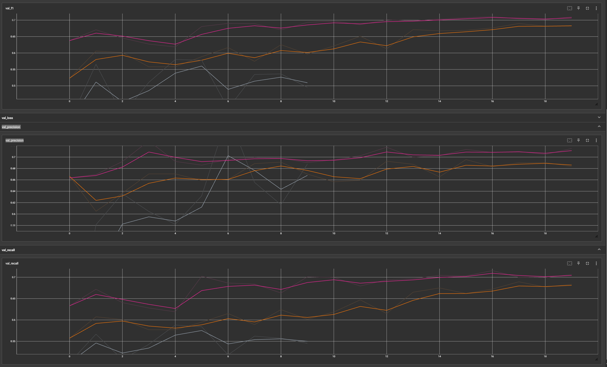

# Breast-Cancer-XRay-Classification

## Project Overview

This project aims to classify breast X-ray images using deep learning models to detect breast cancer. The project is based on the Kaggle competition [RSNA Breast Cancer Detection](https://www.kaggle.com/competitions/rsna-breast-cancer-detection) dataset and task.

## Main Features

1. Data Preprocessing
   * Crop images by `cv2.connectedComponentsWithStats` to highlight the effective parts, as the effective part in the original data occupies less than half.
   * Use `Parallel` to process images concurrently.
2. Model Selection
   * Manually build a Vision Transformer (ViT).
3. Fine Tuning Hyperparameters
   * Provide two ways (PyTorch TensorBoard and Weights & Biases) to monitor training and validation.

## Results



| Version | Pretrained Parameters | Dataset | Epoch | Val F1 | Val Recall | Val Precision |
|----------|-----------------------|---------|-------|--------|------------|---------------|
| backbone | vit_base_in21k | subset  | 10    | 0.56   | 0.57       | 0.61          |
| v2       | Best pth from previous run | subset  | 20    | 0.68   | 0.68       | 0.686         |
| v3       | Best pth from v2 | subset & cropped  | 20    | 0.71   | 0.71       | 0.71         |

## Potential performance improvement ideas:

1. Modify Transformer Model Architecture – Referencing relevant research papers, adjust the Transformer model’s structure to enable it to learn from images originating from different sources separately and then integrate them within the model.

2. Handling Large-Sized Images – Implement a batch segmentation approach, which allows the model to capture finer image details while ensuring that training can be completed using limited computational resources.

## File Descriptions

- `vitmodel/image_ETL.py`: Contains functions for image processing and saving.
- `vitmodel/train.py`: Script for training the model.
- `vitmodel/predict.py`: Script for making predictions.
- `vitmodel/utils.py`: Contains utility functions.

## Usage

### Environment Setup

Ensure the following dependencies are installed:

- Python 3.x
- pandas
- Pillow
- numpy
- joblib
- tqdm
- opencv-python
- pytorch

### Data Preprocessing

Run `vitmodel/image_ETL.py` for data preprocessing:

```sh
python vitmodel/image_ETL.py
```
Model Training
Run train.py to train the model:

```python
python vitmodel/train.py
```

Model Prediction
Run predict.py to make predictions:
```python
python vitmodel/predict.py
```